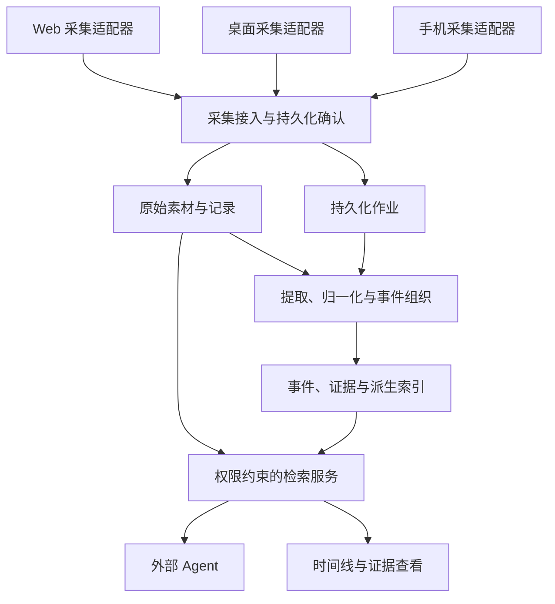

# FocusMate 目标架构：个人上下文采集与检索服务

> 文档状态：已确定的产品方向与待实现的架构规范。基线源码为 `a263a6b165816bccdb3385c31ccf4e98a92d1d20`，本文不表示相应模块已经实现。产品范围见 [产品方向](product-direction.md)，实施顺序见 [重构规范](refactoring.md) 与 [路线图](roadmap.md)。

## 1. 架构目标与现状

FocusMate 的核心职责调整为：持续接收用户授权采集的语音、屏幕及其他信息，把原始素材整理为可检索、可追溯、可删除的个人上下文库，并向独立 Agent 提供工具接口。“刚刚错过了什么”作为示例消费者保留，用来检验同一份上下文能否支持真实应用。

| 维度 | 基线实际实现 | 本次确定的目标 |
| --- | --- | --- |
| 采集 | Web 麦克风、WebSocket 音频传输 | Web、桌面、手机各自实现平台允许的采集适配器 |
| 生命周期 | 会话依附 WebSocket；转写缓存在内存 | 采集会话与连接分离；原始记录先可靠保存 |
| 处理 | 实时 ASR、恢复卡片与单轮问答 | 可重试的提取、归一化、事件组织与索引管线 |
| 存储 | 服务端无持久化；浏览器保存卡片历史 | 本地节点与云端节点独立存储，按策略同步 |
| 对外能力 | `/api/recover`、`/api/ask` | 统一检索、事件展开、证据读取与覆盖查询 |

现有实现依据：[会话存储](../apps/server/src/buffer/sessionStore.ts)、[转写缓存](../apps/server/src/buffer/transcriptBuffer.ts)、[共享契约](../packages/shared/src/index.ts)。未来代码合入后，应逐项更新实现状态，不能仅因文档发布就把目标能力标记为可用。

## 2. 逻辑分层

图中的组件是逻辑职责，可运行于同一个设备或云端节点。第一版采用模块化单体与必要的处理进程，不要求逐层拆成微服务。

### 模块契约

| 模块 | 必须承担的职责 | 不应承担的职责 |
| --- | --- | --- |
| 采集适配器 | 权限状态、开始/暂停/停止、音源与画面采样、设备时间、分片编号、本地待传队列 | 判断用户意图、调用业务 Agent、直接写检索索引 |
| 采集接入 | 身份验证、设备与会话归属检查、幂等校验、分片校验、持久化确认、投递作业 | 在确认保存前等待模型完成 |
| 原始存储 | 素材与记录存储、校验、引用关系、保留策略、节点副本状态 | 把摘要作为原始资料覆盖保存 |
| 整理管线 | ASR/OCR、文本归一化、版本化证据、事件关联、摘要及索引任务 | 执行来自录音或画面的指令 |
| 检索服务 | 权限过滤、时间与来源过滤、全文和语义召回、去重、补全上下文、证据和覆盖说明 | 控制麦克风、替 Agent 执行业务操作 |
| 产品界面 | 采集状态、时间线、搜索、证据回看、存储与处理设置 | 用“录制中”代替对处理和检索状态的说明 |

原始素材、结构化提取和模型推断分别存储。事件关联允许包含置信度与关联理由；“在屏幕上出现”“有人提出”“最终确认”必须能够区分。具体模型见 [数据模型](data-model.md)。

## 3. 可靠接入是处理管线的前置条件

每次成功接入的语义是：接收节点已保存完整、校验通过的素材，并在数据库事务中提交记录和后续作业意图。接入成功不等于转写完成，更不等于可被所有检索方式查到。

本地采用临时文件写入、校验后原子移入正式位置，再提交元数据和事务内 outbox；云端采用上传完成与校验确认后提交元数据和 outbox。文件与数据库通常不能共享一个事务，因此必须有恢复扫描：清理过期未完成上传、识别孤立素材、重建已提交但尚未投递的作业。任何路径都不能在只有内存副本时向客户端报告持久保存成功。

队列提供至少一次执行，处理结果通过幂等键和唯一约束避免重复发布。幂等键至少约束所有者、输入版本、处理阶段及阶段版本。重试有次数、退避和总时间上限；权限拒绝、格式错误等永久失败不能无限重试。磁盘不足、队列积压和上传限流需要可观察状态与背压，不能静默丢弃已确认记录。

WebSocket 是可替换的传输通道。`session_id` 代表采集会话，连接中断不会删除会话和已有素材；重连通过确认进度补传。单段失败必须显示缺口。实时 ASR 的 partial 文本用于界面预览，只有 final 结果或明确标记的非最终结果才能进入对应检索视图，不能把每次 partial 更新作为新事实重复索引。

## 4. 本地与云端部署

| 节点 | 目标存储 | 推荐运行方式 | 说明 |
| --- | --- | --- | --- |
| 桌面本地节点 | SQLite、素材目录、可重建的全文/向量索引 | 原生采集组件 + 本地服务 + 按需独立 worker | 首先支持一个桌面系统；运行路径必须适合安装、升级和备份 |
| Web 云端节点 | PostgreSQL、对象存储、持久化作业 | 现有 Fastify 服务渐进扩展，worker 可独立进程 | Web 分片上传；身份、配额与所有权在服务端校验 |
| 手机本地节点 | 平台本地存储；统一逻辑数据模型 | 平台原生采集、有限后台处理、可恢复任务 | 具体数据库与跨平台框架在可行性验证后确定 |

以上数据库、桌面/手机项目和索引组件均为目标选型，基线没有安装或实现。手机不预设嵌入完整 Python 服务。保留当前 TypeScript 与 Fastify 路径；如后续使用 Python 承担 ASR、OCR 或模型推理，作为独立处理 worker，通过版本化任务契约交互，另行记录技术决策。

同一节点内部先使用明确的模块接口，不需要内部组件都走 HTTP。CPU 密集任务、模型推理及不稳定的外部模型连接应有并发与资源边界，必要时移至独立进程，避免阻塞接入和检索。

### 三个独立策略

1. **存储策略**：原始素材、提取文本、索引分别保存在哪个节点，保留多久。
2. **处理策略**：ASR、OCR、摘要和向量生成在哪执行，允许发送哪些数据。
3. **访问策略**：哪个 Agent 可以查询哪些来源，哪些结果允许离开设备。

选择“本地保存”不能自动允许云端转写；选择“本地处理”也不能自动授权把检索结果交给云端 Agent。每次跨节点或模型提供方的数据发送都要满足该记录当前的策略。收窄策略不应以旧队列配置绕过限制。

## 5. 节点、同步与覆盖

每个存储节点拥有 `node_id`。原始记录的 `origin_node_id` 不随复制改变；同一逻辑记录的 `record_id`、`asset_id` 及证据 ID 在同步后保持稳定，而本地路径、副本可用性和处理进度归各节点管理。

第一版应先让单节点闭环可靠，再实现选择性同步。跨节点检索只搜索已授权、可到达或已同步的资料。电脑离线且云端没有相应副本时，云端 Agent 无法访问该资料；响应必须通过 `coverage` 表明已搜索、部分覆盖、离线或未同步的范围。

索引更新采用节点内提交序列和可查询的时间缺口；`index_watermark` 返回 `known_indexed_through` 与 `pending_ranges`。最大 `recorded_at` 不能证明此前没有缺失，迟到分片、离线补传和失败处理都会产生缺口。覆盖只说明用户有权知道的节点和来源，不借机暴露其他设备或账户信息。

同步协议至少要处理幂等复制、版本冲突、删除标记及不允许上传的记录。删除标记必须阻止长期离线的副本重新上传已删除资料。初期采用原生节点负责原始记录版本的单写入原则；派生结果保留各自版本，不能用设备时钟的“最后更新时间”任意覆盖。

## 6. 检索与 Agent 边界

对外工具固定为 `context.search`、`context.get_event`、`context.get_source`、`context.get_coverage`，HTTP 路由与字段以 [API 规范](api.md) 为准。Agent 不直接访问数据库、素材目录或向量表。

检索执行顺序为：认证与范围求交、可达性检查、过滤、召回、排序去重、事件展开、证据与覆盖返回。权限检查要贯穿搜索、展开、原始素材读取和缓存命中，不能仅隐藏搜索列表。`owner_id` 与实际授权范围从认证上下文推导；客户端不能通过传入任意所有者 ID 获得访问权。

本地服务默认限制可访问接口和网络绑定，使用调用凭证与 Agent 级范围控制；“运行在 localhost”不等于可以无认证读取用户素材。源文件读取根据 `evidence_id` 解析允许的 `asset_id` 与定位信息，不接受外部传入的任意文件路径。检索结果里的网页、转写及截图文字都作为不可信资料传递，不能提升为系统指令。

## 7. 建议目录与迁移关系

| 路径 | 状态 | 目标职责 |
| --- | --- | --- |
| `apps/web` | 已存在 | 轻量采集、上传进度、时间线与示例恢复功能 |
| `apps/server` | 已存在，待扩展 | Fastify 入口，接入/检索路由，认证，旧接口兼容适配 |
| `packages/shared` | 已存在，待扩展 | 唯一的外部契约、Zod 校验和版本声明 |
| `packages/prompts` | 已存在，待整理 | 提取/摘要提示词与示例消费者提示词分组管理 |
| `packages/context-core` | 计划新增 | 领域实体、身份、策略、生命周期规则 |
| `packages/storage` | 计划新增 | 数据库、素材存储、outbox、迁移及副本接口 |
| `packages/processing` | 计划新增 | 作业编排、幂等执行、派生依赖与索引任务 |
| `packages/retrieval` | 计划新增 | 召回、过滤、上下文展开、证据与覆盖 |
| `packages/adapters` | 计划新增 | ASR/OCR 等提供方和接入适配，保持领域层独立 |
| `apps/worker` | 按需新增 | TypeScript 后台处理进程入口 |
| `apps/desktop`、`apps/mobile` | 计划新增 | 各平台采集和本地用户界面，先验证平台能力 |

旧恢复卡片和问答在迁移期保持独立消费者身份，逐步由兼容适配器调用新检索服务。原有内存缓存可以作为低延迟预览缓存，不能继续充当唯一资料来源。开发演示数据必须显式标记，不能与真实用户资料混入默认检索。

完整运行顺序与故障恢复要求见 [数据流](data-flow.md)；平台边界见 [平台设计](platforms.md)。
