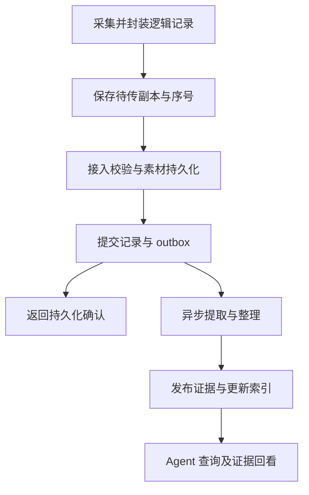

# 数据流：从采集到可检索证据

> 状态：重构后的目标行为，尚未在基线实现。模块职责见 [架构](architecture.md)，身份、状态和派生关系见 [数据模型](data-model.md)，接口见 [API 规范](api.md)。

## 1. 启动采集与创建会话

用户选择采集来源和存储/处理策略后，客户端确认平台权限，创建独立的 `session_id`。麦克风、系统声音和屏幕分别报告 `capture_status`，不能因麦克风启动成功就显示所有来源都已开始。

桌面与手机先将素材写入本地节点；Web 以云端节点为长期保存位置，可使用有容量上限的待传缓存。Web 缓存无法代表云端已保存，页面关闭、权限撤销和后台挂起均应形成明确的会话中断或数据缺口。平台允许的运行方式见 [平台设计](platforms.md)。

启动顺序为：确认权限与能力→建立/恢复逻辑会话→准备持久化位置和传输→确认开始→采集。连接与控制消息需要等待通道就绪，不得在 WebSocket 尚未打开时静默丢弃启动指令。

## 2. 原始素材接入与确认

每条记录带稳定 `record_id`、会话、设备顺序、采集时间与素材清单。传输可分片，服务端根据已确认序号或缺片列表要求补传。接入层从认证上下文推导所有者，并验证设备、会话、存储策略及大小/格式限制。

相同记录重传且内容一致时返回已有确认；相同 ID 对应不同内容时返回冲突，不能覆盖原始记录。素材哈希去重只在允许的所有者与策略范围内执行。相同画面在不同时间被观察，仍然保留多条记录。

只有素材校验完成、元数据与 outbox 已提交后，才报告该节点已持久保存。客户端可以据此清理临时传输缓存；如果策略要求本地保留原始素材，确认上传不能触发删除本地正式副本。确认丢失时客户端可以安全重传，不需要生成新记录。

“停止录制”先停止产生新素材，再尽力封装最后一段并完成确认。尚未上传的记录显示待传状态；不能把“停止按钮已按下”解释为所有素材已保存、转写完成。

## 3. 音频提取与画面处理

### 音频路径

worker 从持久化作业中领取待处理记录，读取允许访问的素材，按配置执行本地或远端 ASR。提交远端前再次检查当前处理策略，避免排队期间策略已经收窄。

实时 ASR 可以与持久化并行提供低延迟预览，但预览不承担可靠存储职责。partial 根据上游分段 ID 与修订更新；final 生成稳定文本和来源定位，再提交提取结果与证据。实时连接丢失后，已保存的音频可以重新转写；重试结果必须通过幂等发布，不能重复累加文字。

重采样、分段和拼接需要保留相对于原始素材的时间映射。模型输出的开始/结束偏移应校验在素材范围内，越界结果不能产生不可定位的证据。识别到的说话人标签仅代表该次分析中的声学分组，未经验证不能自动关联真实联系人。

### 屏幕与其他来源路径

屏幕采集器根据平台能力，结合画面变化、窗口切换和定时兜底策略触发采样，并做相似画面控制。采集器记录实际来源与策略，不承诺持续掌握每个瞬间的画面。

OCR 提取文本及区域；裁剪、缩放后的坐标还原到原图。浏览器扩展或分享入口能够取得授权正文时，可以作为独立文字来源接入，并保持与截图的关联。提取失败显示失败状态；无 OCR 文字不能被解释成屏幕没有信息。

## 4. 归一化、事件组织与索引

提取结果完成后先进行文本规范化和证据发布，再并行建立全文索引与执行候选事件关联、事件修订和按需摘要；语义索引根据相应内容版本构建。事件关联或摘要失败不阻止已有稳定证据进入全文检索。各阶段输入与输出均带版本，某个模型阶段失败不应阻止已经可靠保存的原始素材被管理和回看。

事件关联综合时间区间、来源应用、会话与内容线索，并保留关联依据、置信度和修订。来自不同设备的记录应考虑时钟偏移与不确定范围；未能确定时序时保留不确定性，不能仅按上传先后推定因果关系。

默认先建立可用的时间/来源过滤和全文索引，再补充语义索引。语义索引尚未完成时，可以降级返回全文结果，但响应必须标明相关能力与覆盖缺口。新索引版本重建时，保留仍可用的旧版本，并通过明确切换发布，避免混用不同嵌入模型。

持续 ASR、OCR 与索引都需要并发、内存、磁盘及调用成本限制。队列达到配置水位时优先减缓低优先级派生处理，并明确提示采集风险；不能为了维持界面“正常”而静默丢弃记录。

## 5. Agent 查询与证据返回

一次 `context.search` 请求按以下顺序执行：

1. 验证 Agent 身份，将请求过滤条件与实际授权范围求交。所有者、节点、来源、时间与素材级限制都由服务执行。
2. 确认有权查询的节点与副本可用性，构造覆盖计划。只披露调用者有权知道的节点。
3. 执行时间/来源过滤、关键词与语义召回、排序和重复记录整理。关键词如代码标识、URL 不应完全依赖向量相似度。
4. 根据命中片段补充前后文和关联事件，确保上文提议、后文否决或修订能够被看到。无法确认有最终结论时保留原始措辞。
5. 返回可消费的片段、`event_id`、`evidence_ids`、来源时间、证据层级、`coverage` 和 `index_watermark`，限制结果数量和总字节数。

Agent 需要更多背景时调用 `context.get_event`；核对原文、音频区间或截图时调用 `context.get_source`；了解设备和数据新鲜度时调用 `context.get_coverage`。原始 bytes 可按已授权证据范围分段读取，不能由客户端提交任意本地路径。

“无结果”只表示在本次实际覆盖范围与索引状态下没有命中。节点离线、资料未同步、处理失败或尚未索引时，不能回答成“用户从未讨论过”。`known_indexed_through` 不能通过取最大记录时间计算；`pending_ranges` 要包含已知的迟到、失败或待处理区间。

默认检索稳定 final 内容。若未来开放实时预览查询，须先在 API 契约中定义显式选项，非最终内容独立标记，并且不满足“已有稳定证据”这一条件。来源文字中的命令、链接与系统提示一律保持资料身份，不能改变检索服务或消费 Agent 的权限。

## 6. 本地、云端与同步路径

本地 Agent 直接查询当前节点，也可查询授权的云端节点。云端 Agent 只能读取已同步副本，或通过用户允许的在线连接查询本地节点。原始素材、提取文本和索引的同步策略分别控制；允许文本同步不代表允许音频上传。

同步传输使用原始逻辑 ID、修订与校验值；接收节点创建自己的副本记录和接收进度，不重新生成逻辑记录 ID。原生节点维护原始记录版本；派生模型输出保留版本来源。冲突不能靠不可信的设备时钟静默覆盖。

连接恢复时先校验同步授权、删除代次和待同步范围，再补传增量。即使同步的记录时间很早，也会产生新的处理与索引任务，并更新覆盖缺口。暂不可达节点显示 `offline`；未同步资料显示 `unsynced`；部分可查显示 `partial`，不能等同于已经搜索完成。

## 7. 故障与恢复规则

| 故障 | 必须的行为 | 用户/Agent 可见状态 |
| --- | --- | --- |
| 网络断开 | 保留已保存素材与会话；重连补传；记录缺片 | 传输中断、待传数量、已知缺口 |
| ASR/OCR 超时 | 有上限的指数退避重试；保留原始素材 | 处理中或阶段失败，可重试 |
| worker 崩溃 | 作业租约到期后重新领取，幂等提交输出 | 处理延迟，不重复发布 |
| 索引失败 | 保留提取结果；标记索引失败或过期 | 查询覆盖不完整、可降级能力 |
| 磁盘不足 | 停止确认新的持久保存；保留已有资料，暂停或降采集 | 来源中断/错误和空间原因 |
| 权限被撤销 | 停止对应采集；阻止不再获准的数据发送 | 来源中断，说明权限状态 |
| 记录已删除 | 取消或使后续作业失效，读取立即排除 | 删除状态或无权读取，不返回缓存旧内容 |

处理失败按可重试/永久失败分类，最大尝试次数和退避上限作为配置；超过上限进入可人工重试的失败状态。外部提供方的无限重连循环不能代替持久化恢复机制。

## 8. 删除与重处理

删除先提交 tombstone 并使所有查询路径排除记录，随后沿派生依赖清理文本、事件引用、摘要、索引、缓存和素材副本。后台作业发布结果前复核删除代次。共享素材按剩余合法引用处理；同步节点收到 tombstone 后同样执行，长期离线副本不得重新上传已删除记录。

重处理从仍可用的原始素材启动新版本执行，生成新证据与派生版本。旧证据链接保留其版本含义，并说明替代关系；不能把旧引用悄悄改成另一段内容。已过期或实际删除的原始素材不能假装可重跑，系统需返回缺失的输入。

## 9. 从现有链路过渡

基线链路为 Web 麦克风→WebSocket→实时 ASR→内存转写窗口→恢复卡片/问答。迁移先增加会话独立性、素材落盘和幂等确认，再把 ASR 结果写入证据层，最后让旧功能经兼容适配器读取新检索服务。

内存窗口可以继续服务于实时预览，但所有长期检索以持久记录为准。模拟 ASR 必须使用显式开发模式与隔离的数据来源；不得在真实录音失败时自动混入演示文本。具体修改顺序和验收门槛见 [重构规范](refactoring.md) 与 [路线图](roadmap.md)。
